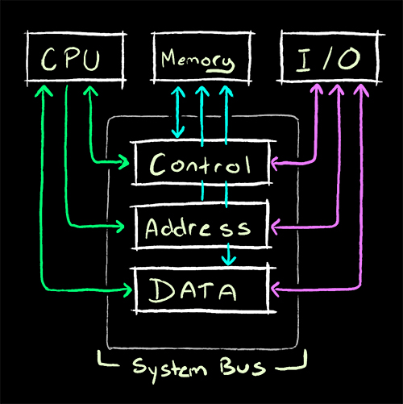

# Data Bus

A data bus is a system within a computer consisting of a connector that provides transportation for data.

A data bus can transfer data to and from the memory of a computer, or in and out of the CPU.  It can also transfer data between two computers.
+ The amount of data transferred is bandwidth.

There are three types of buses:
+ **Address bus**: Carries memory addresses from the processor to other components.  Where the data is and/or where it is going.
+ **Data bus**: Carries the data between the processor and components.  This is the contents that has been read from, or is to be written to memory.
+ **Control Bus**: Carries control signals from the processor to components.  Manages the information flow between components by controlling whether the operation is read or write and making sure it happens at the right time. 
    + Things have to happen at the same speed in the computer, but not all data transfers at the same rate.  Information from the CPU comes faster than information from a component.  The controller ensures everything is working at the same rate.

+ **Parallel Bus**: A parallel bus is used in more complex connections that must carry more than one bit at a time.  Data is carried on many wires simultaneously.
    + A common example of a parallel bus is a PCI bus. This is the bus that transfers data between the motherboard and peripheral that use the PCi standard. (*Peripheral Component Interconnect*)  
+ **Serial Bus**: A serial bus uses a single wire to send and receive data between components.  These have a relatively smaller amount of wires and are less complex than a parallel bus.  USB is a common example. (*Universal Serial Bus*) 

The input/output, or I/O bus is the pathway used for devices to communicate with the computer processor.

Every computer has both internal (local) data buses and external data buses.  The local bus connects all of the components of the motherboard.  The external connect the motherboard to everything else.

---

[Back to Index](comp-sci.md)
